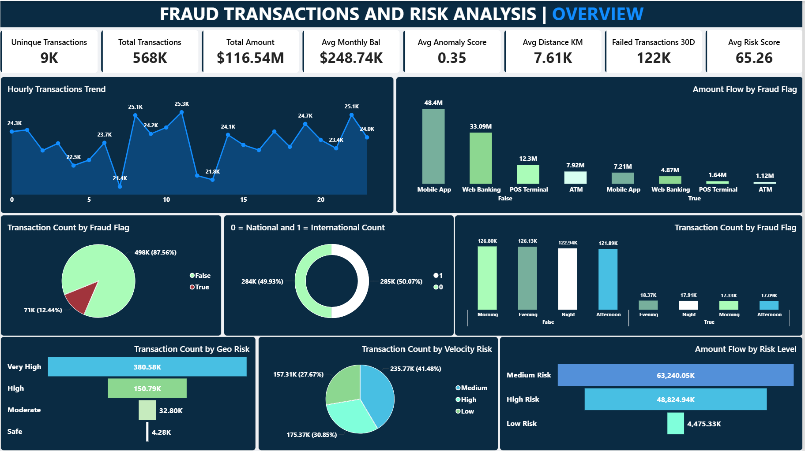

# 📊 Fraud Transactions & Risk Analysis Dashboard 

An enterprise-grade data analytics and risk diagnostic intelligence framework designed to identify financial anomalies, isolate high-risk transactional vectors, and mitigate corporate capital leakage. 

---

## 🚀 Live Links & Contact
* **Report Generated By:** Md Saleh  
* **📬 Email:** [mdsalehh09@gmail.com](mailto:mdsalehh09@gmail.com)  
* **💼 LinkedIn:** [Connect with me on LinkedIn](https://www.linkedin.com/in/md-saleh-163b44284/)
* **🛠️ Open for Freelance Projects & Strategic Consulting Roles**

---

## 📌 Business Overview & Core Objectives
In modern financial ecosystems, raw data without rigorous engineering and predictive modeling leaves organizations exposed to sophisticated threat actors. This project delivers a comprehensive diagnostic analysis of **568K transactions** accounting for **$116.54M in total volume**, isolating the structural variances between standard consumer behaviors and automated fraud systems.

### Key Executive KPIs:
* **Total Transactions:** 568K
* **Total Value Monitored:** $116.54M
* **Unique Transactions:** 9K
* **Average Monthly Balance:** $248.74K
* **Avg Risk Score:** 65.26 / 100
* **Avg Anomaly Score:** 0.35
* **Failed Transactions (30D Rolling):** 122K
* **Avg Distance (Geographic Extension):** 7.61K KM

---

## 📈 Dashboard Architecture & Insights

### 1. Volumetric Fraud Distribution
* **Legitimate (False):** 498K (87.56%)
* **Confirmed Fraud (True):** 71K (12.44%)
* *Insight:* While legitimate traffic forms the vast majority, a baseline fraud rate of 12.44% represents severe margin friction requiring proactive algorithmic step-up challenges.

### 2. Channel Dynamics & Capital Flight
Digital interface avenues dominate financial exposure, making mobile application security the highest priority:
* 📱 **Mobile Application:** $48.40M Legitimate | **$7.21M Fraudulent** *(Highest absolute exposure)*
* 🌐 **Web Banking:** $33.09M Legitimate | **$4.87M Fraudulent**
* 🛒 **POS Terminal:** $12.30M Legitimate | **$1.64M Fraudulent**
* 🏧 **ATM Network:** $7.92M Legitimate | **$1.12M Fraudulent**

### 3. Diurnal & Geospatial Risk Profiling
* **Geographic Origin:** Split perfectly across borders—**50.07% International** vs. **49.93% National**, proving the need for high-throughput cross-border anti-fraud rules without added transaction latency.
* **Temporal Patterns:** Legitimate activity drops during afternoon hours. In contrast, **True Fraud peaks heavily during Evening (18.37K) and Nighttime (17.91K) windows**, exploiting lowered human-monitoring guardrails typical of off-hour processing cycles.

### 4. Risk Stratification Footprint
* **Geographic Risk:** A staggering **380.58K transactions** sit within the *Very High Risk* band, signaling hostile network or location spoofing vectors.
* **Velocity Risk:** Managed highly by *Medium Risk* speed parameters (41.48%), followed by *High Velocity Risk* at 30.85%, reflecting widespread automation and rapid-fire payment routing.
* **Financial Weight:** *Medium Risk* transactions command the absolute majority of capital flow at **$63.24M**, followed by *High Risk* positions at **$48.82M**.

---

## 🛠️ Tech Stack & Skills Utilized
* **Data Visualization & BI:** Power BI / Tableau (Executive-level theme engineering & UX mapping)
* **Data Pipelines & Analytics:** Python (Pandas, NumPy, Automated ETL Pipeline Construction)
* **Reporting Architectures:** WeasyPrint HTML-to-PDF Engineering, Markdown Document Automation
* **Domain Expertise:** Risk Management, Fraud Detection Systems, Behavioral Analytics, Core Financial KPIs

---

## 🤝 Let's Collaborate! (Available for Freelance & Consulting)
Are you looking to transform your raw data assets into secure, enterprise-grade business intelligence? I specialize in building responsive reporting suites, optimizing ETL pipelines, and translating complex data into immediate high-ROI strategies.

### What I Bring to Your Team:
1. **Automated Fraud Diagnostics:** Custom algorithmic filters to flag risk anomalies instantly.
2. **Executive Boardroom Dashboards:** Beautiful, interactive analytics frameworks built with advanced custom design tokens.
3. **Optimized Enterprise Data Pipelines:** High-speed ETL jobs written for ultimate multi-departmental clarity.

### 📩 Contact Channels
If you have a project, an open consulting role, or want to discuss scaling your data operations, don't hesitate to reach out!
* **Email:** [mdsalehh09@gmail.com](mailto:mdsalehh09@gmail.com)
* **LinkedIn:** [linkedin.com/in/md-saleh-163b44284/](https://www.linkedin.com/in/md-saleh-163b44284/)

---
*Report framework designed and engineered by Md Saleh.*
